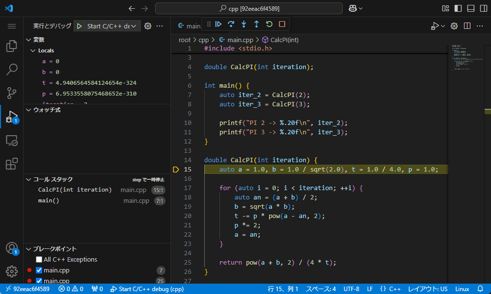

# C/C++のデバッグ

## デバッグすると

プログラムの任意の行で**ブレイク**(処理を止めること)できます。
具体的には、🔴ブレイクポイントを設定した行でブレイクします。


この場合、7行目の処理が実行される直前で処理が止められています。

関数の値が返される前に**ステップイン**すると、その関数に入れます。


この場合、7行目から関数`CalcPI`に入りました。
引数`iteration`の値として`2`が渡されていることがわかります。

**ステップオーバー**で1行ずつ処理を追うことができます。
**ステップ実行**ってやつです。



この場合、for文の中身がループ実行されていることがわかります。

続行ボタンを押すと次にブレイクするまで処理を実行します。


関数の処理の途中で関数から抜け出すには**ステップアウト**します。


この場合、関数`CalcPI`の残りの処理が終わってから、7行目に戻りました。

関数内の処理を追う必要がなければ、ブレイクポイントを設定せず、ステップオーバーします。


この場合、8行目の関数`CalcPI`の呼び出しでは、ブレイクが発生しませんでした。

**デバッグコンソール**を使うと、処理を止めた部分でほぼ任意のコードを実行できます。


この場合、変数`iter_3`に`3`を代入しました。

実行を完了させるには、続行ボタンを押します。


また、ブレイクポイントが設定されていなくても、例外が発生するとブレイクします。


この場合、8行目で範囲外アクセスを行ったことにより、例外が発生したことがわかります。

## デバッグするには

デバッグを行うにはデバッガと拡張機能をインストールし、デバッグの構成をする必要があります。

|デバッガ|拡張機能|
|:-:|:-:|
|GDBまたはLLDB|[C/C++](https://marketplace.visualstudio.com/items?itemName=ms-vscode.cpptools)|

デバッガは`gdb -v`や`lldb -v`を実行するとインストールされているか確認できます。

デバッグの構成をするためにはソースファイル単体ではなく、フォルダを開きます。
さらにデバッグを行うためにフォルダを信頼します。


以下のファイルを作成します。

```json title=".vscode/launch.json"
{
    "version": "2.0.0",
    "configurations": [
        {
            "name": "Start C/C++ debug",
            "type": "cppdbg",
            "request": "launch",
            "program": "${fileDirname}/${fileBasenameNoExtension}",
            "args": [],
            "stopAtEntry": false,
            "cwd": "${fileDirname}",
            "environment": [],
            "externalConsole": false,
            "MIMode": "gdb",
            "setupCommands": [
                {
                    "text": "-enable-pretty-printing",
                    "ignoreFailures": true
                },
                {
                    "text": "-gdb-set disassembly-flavor intel",
                    "ignoreFailures": true
                }
            ],
            "preLaunchTask": "Build tha active C/C++ file"
        }
    ]
}
```


```json title=".vscode/tasks.json"
{
    "version": "2.0.0",
    "tasks": [
        {
            "label": "Build tha active C/C++ file",
            "type": "cppbuild",
            "command": "g++",
            "args": [
                "-g",
                "${file}",
                "-o",
                "${fileDirname}/${fileBasenameNoExtension}"
            ],
            "options": {
                "cwd": "${fileDirname}"
            },
            "problemMatcher": [
                "$gcc"
            ],
            "group": {
                "kind": "build",
                "isDefault": true
            }
        }
    ]
}
```


行番号の左側をクリックして、好きな行にブレイクポイントを入れましょう。
実行中にも追加できます。


もう一度クリックすると消せます。Shiftキーを押しながらクリックすると、消さずに無効化できます。

これで準備は完了です！
いざ、デバッグの世界へ！！

## サンプルコード

デモに使用しているコードです。

```cpp title="main.cpp"
#include <stdio.h>
#include <math.h>

double CalcPI(int iteration);

int main() {
    auto iter_2 = CalcPI(2);
    auto iter_3 = CalcPI(3);

    printf("PI 2 -> %.20f\n", iter_2);
    printf("PI 3 -> %.20f\n", iter_3);
}

double CalcPI(int iteration) {
    auto a = 1.0, b = 1.0 / sqrt(2.0), t = 1.0 / 4.0, p = 1.0;

    for (auto i = 0; i < iteration; ++i) {
        auto an = (a + b) / 2;
        b = sqrt(a * b);
        t -= p * pow(a - an, 2);
        p *= 2;
        a = an;
    }

    return pow(a + b, 2) / (4 * t);
}
```

```cpp title="mistake.cpp"
#include <stdio.h>
#include <vector>

int main() {
    std::vector<int> vector = { 0, 1, 2, 3, 4 };

    for (auto i = 1; i <= 5; ++i) {
        printf("No. %d: %d\n", i, vector.at(i));
    }
}
```
