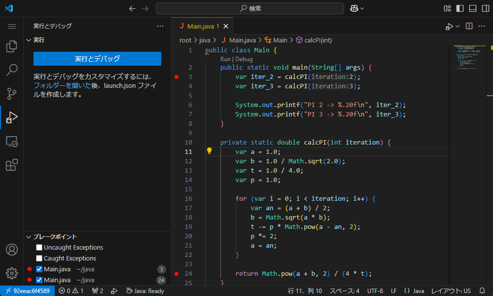
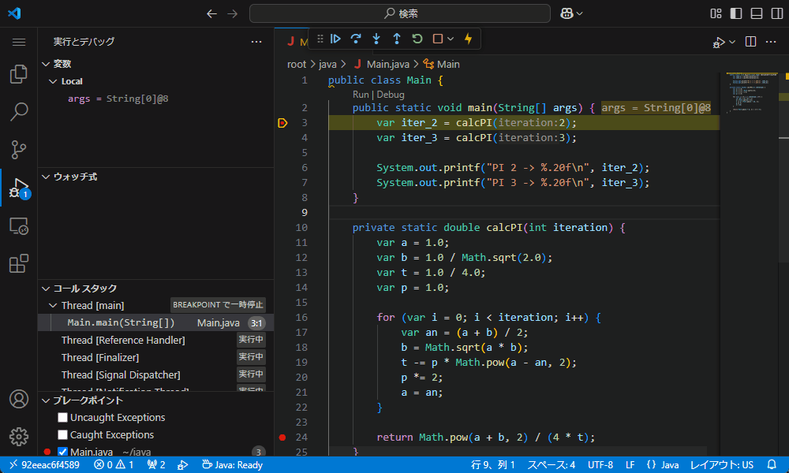
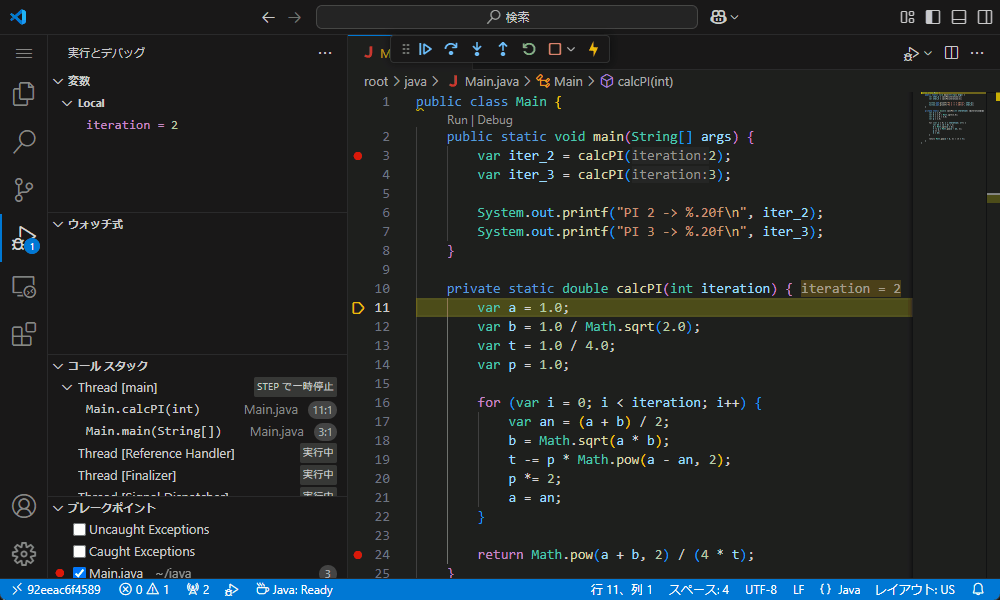
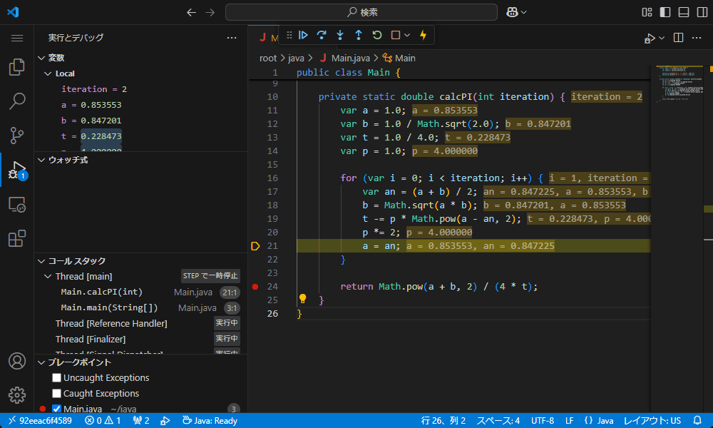
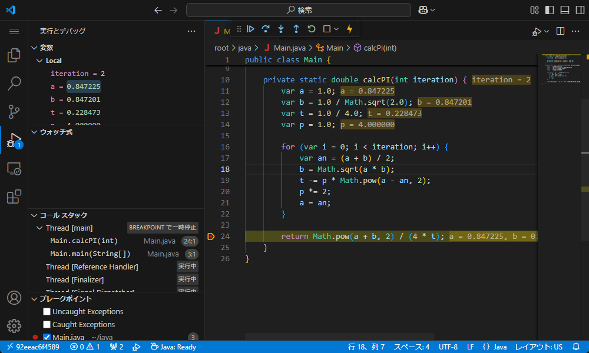
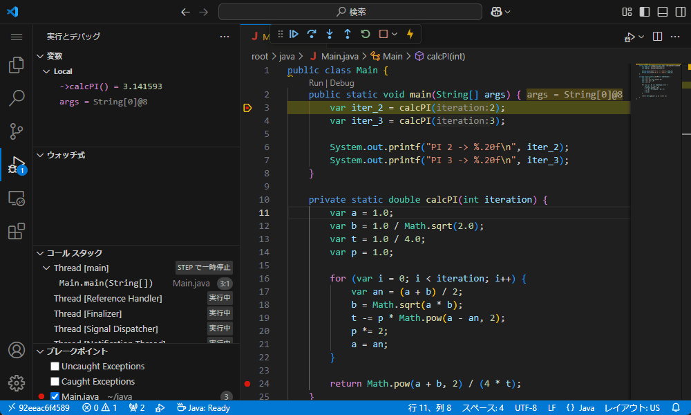
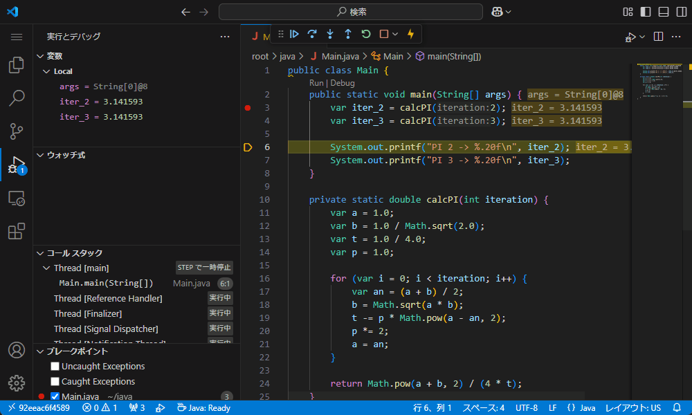
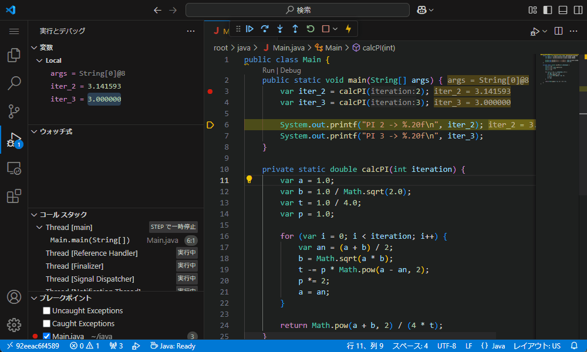
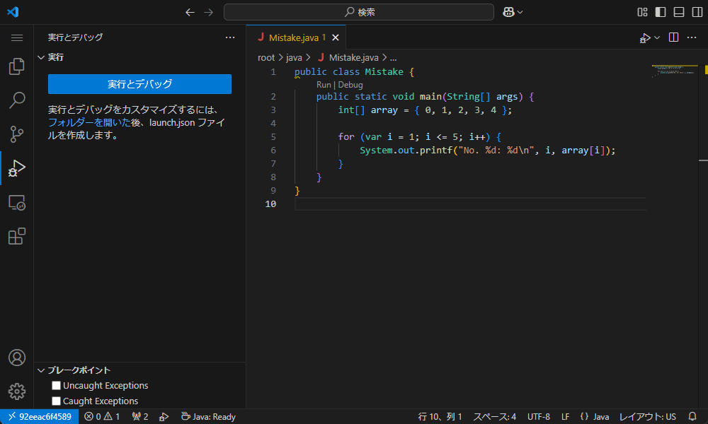
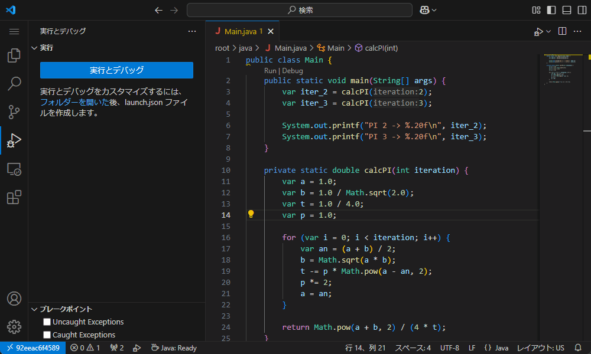

# Javaのデバッグ

## デバッグすると

プログラムの任意の行で**ブレイク**(処理を止めること)できます。
具体的には、🔴ブレイクポイントを設定した行でブレイクします。



この場合、3行目の処理が実行される直前で処理が止められています。

関数の値が返される前に**ステップイン**すると、その関数に入れます。



この場合、3行目から関数`calcPI`に入りました。
引数`iteration`の値として`2`が渡されていることがわかります。

**ステップオーバー**で1行ずつ処理を追うことができます。
**ステップ実行**ってやつです。



この場合、for文の中身がループ実行されていることがわかります。

続行ボタンを押すと次にブレイクするまで処理を実行します。



関数の処理の途中で関数から抜け出すには**ステップアウト**します。



この場合、関数`calcPI`の残りの処理が終わってから、3行目に戻りました。

関数内の処理を追う必要がなければ、ブレイクポイントを設定せず、ステップオーバーします。



この場合、4行目の関数`calcPI`の呼び出しでは、ブレイクが発生しませんでした。

**デバッグコンソール**を使うと、処理を止めた部分でほぼ任意のコードを実行できます。



この場合、変数`iter_3`に`3`を代入しました。

実行を完了させるには、続行ボタンを押します。



また、ブレイクポイントが設定されていなくても、例外が発生するとブレイクします。
Uncaught Exceptionsのチェックを入れておくとよいでしょう。



この場合、6行目で範囲外アクセスを行ったことにより、例外が発生したことがわかります。

## デバッグするには

デバッグを行うには拡張機能をインストールする必要があります。

|拡張機能|
|:-:|
|[Debugger for Java](https://marketplace.visualstudio.com/items?itemName=vscjava.vscode-java-debug)と[Language Support for Java(TM) by Red Hat](https://marketplace.visualstudio.com/items?itemName=redhat.java)|

行番号の左側をクリックして、好きな行にブレイクポイントを入れましょう。
実行中にも追加できます。



もう一度クリックすると消せます。Shiftキーを押しながらクリックすると、消さずに無効化できます。

これで準備は完了です！
いざ、デバッグの世界へ！！

## サンプルコード

デモに使用しているコードです。

```java title="Main.java"
public class Main {
    public static void main(String[] args) {
        var iter_2 = calcPI(2);
        var iter_3 = calcPI(3);

        System.out.printf("PI 2 -> %.20f\n", iter_2);
        System.out.printf("PI 3 -> %.20f\n", iter_3);
    }

    private static double calcPI(int iteration) {
        var a = 1.0;
        var b = 1.0 / Math.sqrt(2.0);
        var t = 1.0 / 4.0;
        var p = 1.0;

        for (var i = 0; i < iteration; i++) {
            var an = (a + b) / 2;
            b = Math.sqrt(a * b);
            t -= p * Math.pow(a - an, 2);
            p *= 2;
            a = an;
        }

        return Math.pow(a + b, 2) / (4 * t);
    }
}
```

```java title="Mistake.java"
public class Mistake {
    public static void main(String[] args) {
        int[] array = { 0, 1, 2, 3, 4 };

        for (var i = 1; i <= 5; i++) {
            System.out.printf("No. %d: %d\n", i, array[i]);
        }
    }
}
```
