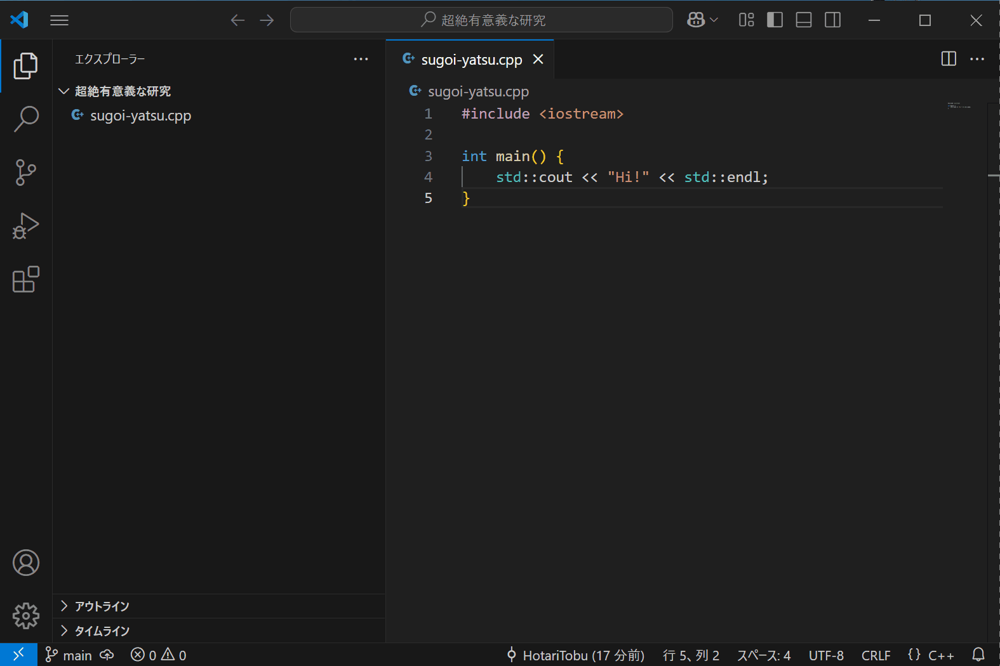

# Git

## Gitのうまみ

[Git](https://git-scm.com)はファイルの変更履歴を追跡するためのバージョン管理システムです。
ここまで読んでこの場を立ち去ろうとしたそこのあなた、待ってください。
研究だからGitなんて必要ない？
いいえ違います。

Gitのメリットは、要は**変更を元に戻せる**ことです。
Undoすればよいではないか？
大体のアプリのUndo履歴はアプリを閉じるとリセットされますが、Gitの記録はリポジトリを滅さない限り残り続けます。
つまり、あなたがファイルを作り出したその瞬間にまでさかのぼれるのです。

さあ、今からあなたもLet's try git!

## めためた大雑把な流れを説明します


**コミット**は、そこまでさかのぼることができる、チェックポイントを作るような操作です。

**チェックアウト**は、ここでは特定のコミットした時の状態に戻ることとしましょう。

以上。

## コミットとは何ですか。ライザップ？

コミットでは、先に述べたようにチェックポイントを作ります。コミットを細かく分けると以下のようになります。


まずはファイルの変更です。思うがままにソースコードをいじるなり、データを追加するなりしましょう。

コミットは、すべての変更に対してではなく、対象のファイルを選んで実行できます。この選択を**ステージング**と呼びます。ファイル単位ではなく行単位でもできますが、それは知らんでもよろし。
まぁ、すべてのファイルを1つのコミットにまとめても良いです。

コミットには、その内容を表すメッセージが必要です。
未来の自分に手紙を書くように「こんな風に変更したよ」と教えてあげましょう。
きっと喜んでくれるはずです。
Whyを書くのは難しいので気にしないでください。

## 具体的な手順

ここでは[VSCode](https://code.visualstudio.com/)を使った簡単な手順を紹介します。
コマンドラインを使った手順については説明しませんので、コマンドライン至上主義の方はお帰りいただいても構いません。

### オレだよオレオレ

この操作はデバイスのログインアカウントごとに初回のみ必要です。
コミットには名前とメールアドレスが必要なので、コマンドでGitに自分が誰であるかをわからせます。
以下のコマンドをターミナルで実行しましょう。
`{{}}`の部分は自分のものに置き換えてください。

```sh
git config --global user.name "{{あなたの名前}}"
git config --global user.email "{{あなたのメールアドレス}}"
```


GitHubアカウントを持っている場合、GitHubのユーザー名を名前にして、GitHubに登録したメールアドレスを使うとよいでしょう。

### Open folder…

VSCodeでフォルダを開きます。
個別にファイルを開いてもGitは使えません。


### それは信頼するということ

開いたフォルダでGitを使うには、そのフォルダを信頼する必要があります。


### リポジトリの初期化

この操作はフォルダごとに初回のみ必要です。
また、すべてのファイルをステージして初期コミットを作っておきましょう。


### 研究を行う

研究を行ってください。
それに伴ってファイルがいくつか変更されているはずです。


### こまめにコミットしよう

切りのいいところで、変更されたファイルをステージしてコミットを作成しましょう。
そうしないと、後で泣きを見ることになるかもしれません。
また、コミットメッセージを入力し忘れると面倒くさいので忘れずに。


### 昨日までは動いてたんだけど

そんな時はチェックアウトです。
戻りたいコミットを選択してチェックアウトです。



### やっぱり戻したのを戻したいわ

そんな時もチェックアウトです。
`main`にチェックアウトすると現代へ戻ってこられるでしょう。


## 勉強熱心なあなたのために

**ブランチ**について調べると、もっとGitと友達になれます。
ITエンジニアの友達もできます。
人生成功します。
