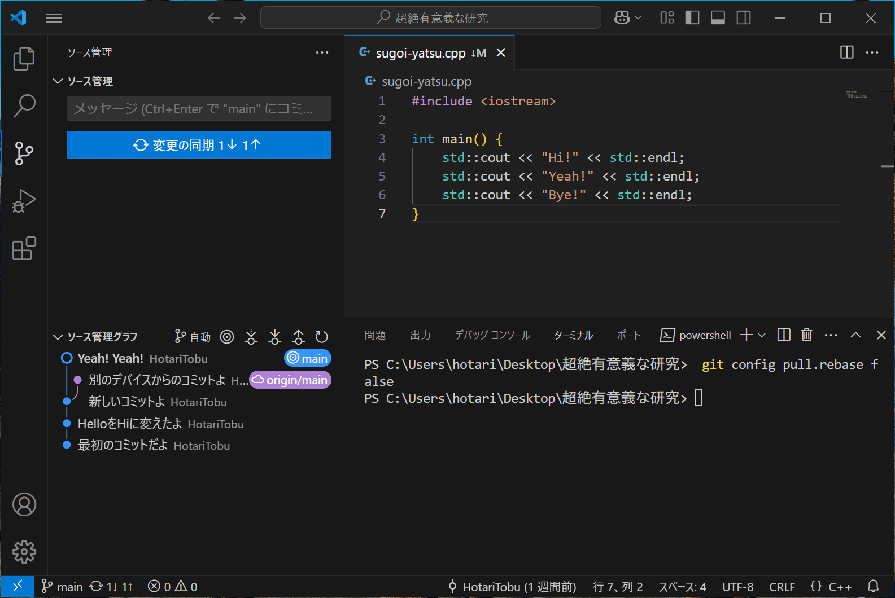

# GitHub

import GitLogo from "./img/git-logo.svg"
import GitHubLogo from "./img/github-logo.svg"

## Gitはもうやったじゃん💢💢

[GitHub](https://github.com)はGitリポジトリのホスティングサービスです。
Gitとは違います。
<GitLogo style={{width: "auto", height: "0.8rem"}}/>Gitと<GitHubLogo style={{width: "auto", height: "0.8rem"}}/>GitHubの関係は以下のようなイメージです。


少し複雑だったかもしれません。
簡単にいうと、GitHubを使えばデバイス間でファイルを同期できるのです。

## Googleドライブでも同期はできるもん💢💢

[Googleドライブ](https://workspace.google.com/intl/ja/products/drive/)を使えば、直感的にファイルをデバイス間で共有できます。
バージョン管理も一応できるので、スーパーハイパーGoogleドライブ使いのあなたはGitHubを使う必要はないかもしれません。

## OneDriveでも同期はできるもん💢💢

(ry

## iCloud Driveでも同期はできるもん💢💢

(ry

## GitHubって必要なの💢💢

先述した通り、ここではデバイス間でのファイルの同期にGitHubを使うことを想定しています。
「私はこのパソコン以外使ってやらないんだからねっ」という人にはGitHubは必要ではありません。

GitHubを使う一番のメリットは、Gitとのシームレスな連携です。
研究においては、Gitでバージョン管理をしつつ、GitHubで研究室のパソコンと自分のパソコンのファイルを同期するといった具合です。

## GitHubってどうやって使うの💢💢

### GitHubアカウントの作成

まずはアカウントを作成しましょう。


あなたが本当に人間であると、スパムのロボットではないと信じてもらえたら、入力したメールアドレス宛に届く8桁の認証コードを入力してください。
そうすればGitHubへの仲間入りです。

### リポジトリの準備

Gitで初期化されたフォルダを開きます。
そして、全ての変更がコミットされている状態で、ブランチの発行ボタンを押します。
最初はサインインを求められると思うので、GitHubにサインインします。
最後に**private**か**public**かを選択すれば、GitHub上にファイルがアップロードされます🎉


### フェッチの自動実行

また、VSCodeに**フェッチ**を定期的に実行してもらうようにしましょう。
きっと同期のし忘れを防げます。


### ローカルからリモートへ

新しいコミットを作成して作業を終えたら、GitHubに変更を送りましょう。


### リモートからローカルへ

別のデバイスで作業をしていたら、忘れずにGitHubから変更を受け取りましょう。


## 間違えて同期する前にコミットしちゃった💢💢

GitHubから変更を受け取る前にローカルでコミットをしてしまったら、おまじないをするしかありません。

### なんか`↓M`って付いてるけどコミット


あーやってしまいましたね。
**リセット**と**スタッシュ**を行えば、とりあえずGitHubの変更を受け取れますが、ここでは**マージ**を行うことにします。

### マージするように

このまま同期しようとしても、エラーっぽい何かが出ますね。
以下のコマンドをターミナルで実行し「俺は何が何でもマージするんだよぉ！」とGitにわからせます。

```sh
git config pull.rebase false
```


これで何事もなければ同期できるようになるはずです。

### コンフリクトの解消

Gitがうまくマージしてくれないようです。
この状態を**コンフリクト**と呼びます。
ここでGitを責めてはいけません。
冷静に、以下の選択肢からコンフリクトを解消する方法を選んでください。

- 別のデバイスからの変更を残し、ローカルの変更を破棄する
- ローカルの変更を残し、別のデバイスからの変更を破棄する
- 両方の変更を残す


