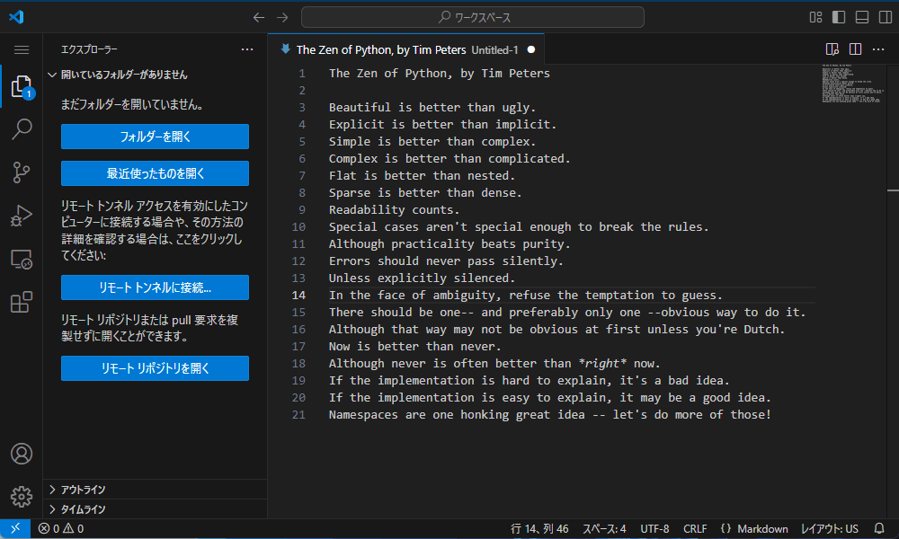

# 中級編

import { ShortcutTabs } from '../ShortcutTabs';
import { TextEditor, Browser, ItemList, RichTextEditor, DesignTool, VSCode } from '../icons';

## マッチ選択

|意味|対象|
|:-:|:-:|
|次にマッチする箇所を追加で選択する|<VSCode />|

<ShortcutTabs
  win={"Ctrl + D"}
  mac={"Cmd + D"}
/>

## 行コピー

|意味|対象|
|:-:|:-:|
|何も選択されていないとき、行をコピーする|<VSCode />|

<ShortcutTabs
  win={"Ctrl + C"}
  mac={"Cmd + C"}
/>

## 行カット

|意味|対象|
|:-:|:-:|
|何も選択されていないとき、行をカットする|<VSCode />|

<ShortcutTabs
  win={"Ctrl + X"}
  mac={"Cmd + X"}
/>

## 行を上げる

|意味|対象|
|:-:|:-:|
|選択している行を上げる|<VSCode />|

<ShortcutTabs
  win={"Alt + ▲"}
  mac={"Opt + ▲"}
/>

## 行を下げる

|意味|対象|
|:-:|:-:|
|選択している行を下げる|<VSCode />|

<ShortcutTabs
  win={"Alt + ▼"}
  mac={"Opt + ▼"}
/>

## 行を上に複製

|意味|対象|
|:-:|:-:|
|選択している行を上に複製する|<VSCode />|

<ShortcutTabs
  win={"Alt + Shift + ▲"}
  mac={"Opt + Shift + ▲"}
/>

## 行を下に複製

|意味|対象|
|:-:|:-:|
|選択している行を下に複製する|<VSCode />|

<ShortcutTabs
  win={"Alt + Shift + ▼"}
  mac={"Opt + Shift + ▼"}
/>

## 上に行を追加

|意味|対象|
|:-:|:-:|
|選択している行の上に行を追加する|<VSCode />|

<ShortcutTabs
  win={"Ctrl + Shift + Enter"}
  mac={"Cmd + Shift + Enter"}
/>

## 下に行を追加

|意味|対象|
|:-:|:-:|
|選択している行の下に行を追加する|<VSCode />|

<ShortcutTabs
  win={"Ctrl + Enter"}
  mac={"Cmd + Enter"}
/>

## インデントを上げる

|意味|対象|
|:-:|:-:|
|選択している行のインデントを上げる|<VSCode />|

<ShortcutTabs
  win={"Ctrl + ["}
  mac={"Cmd + ["}
/>

## インデントを下げる

|意味|対象|
|:-:|:-:|
|選択している行のインデントを下げる|<VSCode />|

<ShortcutTabs
  win={"Ctrl + ]"}
  mac={"Cmd + ]"}
/>

## 上にカーソル追加

|意味|対象|
|:-:|:-:|
|何も選択していないとき、上にカーソルを追加する|<VSCode />|

<ShortcutTabs
  win={"Ctrl + Alt + ▲"}
  mac={"Opt + Cmd + ▲"}
/>

## 下にカーソル追加

|意味|対象|
|:-:|:-:|
|何も選択していないとき、下にカーソルを追加する|<VSCode />|

<ShortcutTabs
  win={"Ctrl + Alt + ▼"}
  mac={"Opt + Cmd + ▼"}
/>

## 矩形選択

|意味|対象|
|:-:|:-:|
|長方形にテキストを選択する|<VSCode />|

<ShortcutTabs
  win={"{ マウスホイールボタンドラッグ }"}
  mac={"{ マウスホイールボタンドラッグ }"}
/>

## コメントの切り替え

|意味|対象|
|:-:|:-:|
|選択している行のコメントを切り替える|<VSCode />|

<ShortcutTabs
  win={"Ctrl + /"}
  mac={"Cmd + /"}
/>

## コマンドパレットを開く

|意味|対象|
|:-:|:-:|
|コマンドパレットを開く|<VSCode />|

VSCodeの操作は全てコマンドパレットから行えます。
逆にあらゆる処理をコマンドとして抽象化しているのがVSCodeの強みです。

<ShortcutTabs
  win={"Ctrl + Shift + P"}
  mac={"Cmd + Shift + P"}
/>

## クイックオープン

|意味|対象|
|:-:|:-:|
|ワークスペースのファイルをリストから選んで開く|<VSCode />|

開いた時刻の降順で表示されるので便利です。

<ShortcutTabs
  win={"Ctrl + P"}
  mac={"Cmd + P"}
/>

## フォーマット

|意味|対象|
|:-:|:-:|
|ファイル全体をフォーマット(整形)する|<VSCode />|

<ShortcutTabs
  win={"Shift + Alt + F"}
  mac={"Shift + Opt + F"}
/>

## サイドバーの切り替え

|意味|対象|
|:-:|:-:|
|サイドバーの表示を切り替える|<VSCode />|

<ShortcutTabs
  win={"Ctrl + B"}
  mac={"Cmd + B"}
/>

## ワークスペース検索

|意味|対象|
|:-:|:-:|
|サイドバーの検索パネルにフォーカスする|<VSCode />|

<ShortcutTabs
  win={"Ctrl + Shift + F"}
  mac={"Cmd + Shift + F"}
/>

## 新しいターミナルを開く

|意味|対象|
|:-:|:-:|
|新しいターミナルを開く|<VSCode />|

<ShortcutTabs
  win={"Ctrl + Shift + `"}
  mac={"Cmd + Shift + `"}
/>

## 全検索

|意味|対象|
|:-:|:-:|
|アプリやファイルなど、様々なものを検索する|アプリ全般|

<ShortcutTabs
  win={"Win"}
  mac={"Cmd + Space / Cmd + Opt + Space"}
/>

## アプリの切り替え

|意味|対象|
|:-:|:-:|
|アクティブなアプリを切り替える|アプリ全般|

<ShortcutTabs
  win={"Alt + Tab"}
  mac={"Cmd + Tab"}
/>

## デスクトップの表示

|意味|対象|
|:-:|:-:|
|デスクトップを表示する|アプリ全般|

<ShortcutTabs
  win={"Win + D"}
  mac={"Fn + H"}
/>

## 絵文字の入力

|意味|対象|
|:-:|:-:|
|絵文字を入力するためのウィンドウを表示する|アプリ全般|

<ShortcutTabs
  win={"Win + . / Win + :"}
  mac={"Fn"}
/>

## 印刷

|意味|対象|
|:-:|:-:|
|印刷する|アプリ全般|

<ShortcutTabs
  win={"Ctrl + P"}
  mac={"Cmd + P"}
/>

## 戻る

|意味|対象|
|:-:|:-:|
|直前の画面に戻る|<Browser /> <ItemList />|

<ShortcutTabs
  win={"Alt + ◀"}
  mac={"Cmd + ["}
/>

## 進む

|意味|対象|
|:-:|:-:|
|[戻る](#戻る)の直後の画面に進む|<Browser /> <ItemList />|

<ShortcutTabs
  win={"Alt + ▶"}
  mac={"Cmd + ]"}
/>

## 上がる

|意味|対象|
|:-:|:-:|
|上の階層へ行く|<ItemList />|

<ShortcutTabs
  win={"Alt + ▲"}
  mac={"Cmd + ▲"}
/>

## 新しいファイル

|意味|対象|
|:-:|:-:|
|新しいファイルを作成する|<TextEditor />|

<ShortcutTabs
  win={"Ctrl + N"}
  mac={"Cmd + N"}
/>

## 新しいタブを開く

|意味|対象|
|:-:|:-:|
|空の新しいタブを開く|<Browser /> <ItemList />|

<ShortcutTabs
  win={"Ctrl + T"}
  mac={"Cmd + T"}
/>

## 次のタブ

|意味|対象|
|:-:|:-:|
|次のタブに移動する|<Browser /> <VSCode />|

<ShortcutTabs
  win={"Ctrl + Tab"}
  mac={"Ctrl + Tab"}
/>

## 前のタブ

|意味|対象|
|:-:|:-:|
|前のタブに移動する|<Browser /> <VSCode />|

<ShortcutTabs
  win={"Ctrl + Shift + Tab"}
  mac={"Shift + Ctrl + Tab"}
/>

## タブを閉じる

|意味|対象|
|:-:|:-:|
|アクティブなタブを閉じる|<Browser /> <VSCode />|

<ShortcutTabs
  win={"Ctrl + W"}
  mac={"Cmd + W"}
/>

## 閉じたタブを開く

|意味|対象|
|:-:|:-:|
|直前に閉じたタブを開く|<Browser /> <VSCode />|

<ShortcutTabs
  win={"Ctrl + Shift + T"}
  mac={"Cmd + Shift + T"}
/>

## 新しいウィンドウを開く

|意味|対象|
|:-:|:-:|
|新しいウィンドウを開く|<Browser /> <ItemList />|

<ShortcutTabs
  win={"Ctrl + N"}
  mac={"Cmd + N"}
/>

## 新しいプライベートウィンドウを開く

|意味|対象|
|:-:|:-:|
|新しいプライベートウィンドウを開く|<Browser />|

<ShortcutTabs
  win={"Ctrl + Shift + N"}
  mac={"Cmd + Shift + N"}
/>

## 新しいVSCodeウィンドウを開く

|意味|対象|
|:-:|:-:|
|新しいVSCodeウィンドウを開く|<VSCode />|

<ShortcutTabs
  win={"Ctrl + Shift + N"}
  mac={"Cmd + Shift + N"}
/>

## ウィンドウを閉じる

|意味|対象|
|:-:|:-:|
|アクティブなウィンドウを閉じる|アプリ全般|

<ShortcutTabs
  win={"Alt + F4"}
  mac={"Cmd + W"}
/>

## リロード

|意味|対象|
|:-:|:-:|
|ページを再読み込みする|<Browser />|

<ShortcutTabs
  win={"F5 / Ctrl + R"}
  mac={"Cmd + R"}
/>

## 新しいタブで開く

|意味|対象|
|:-:|:-:|
|リンクを新しいタブで開く|<Browser />|

<ShortcutTabs
  win={"Ctrl + { クリック }"}
  mac={"Cmd + { クリック }"}
/>

## エクスプローラーを開く

|意味|対象|
|:-:|:-:|
|Windowsエクスプローラーを開く|アプリ全般|

<ShortcutTabs
  win={"Win + E"}
  mac={
macOSに同様のショートカットはありません
}
/>

## 実行

|意味|対象|
|:-:|:-:|
|コマンドを指定して実行したり、パスを指定してフォルダやファイルを開いたりする|アプリ全般|

<ShortcutTabs
  win={"Win + R"}
  mac={
macOSに同様のショートカットはありません
}
/>
