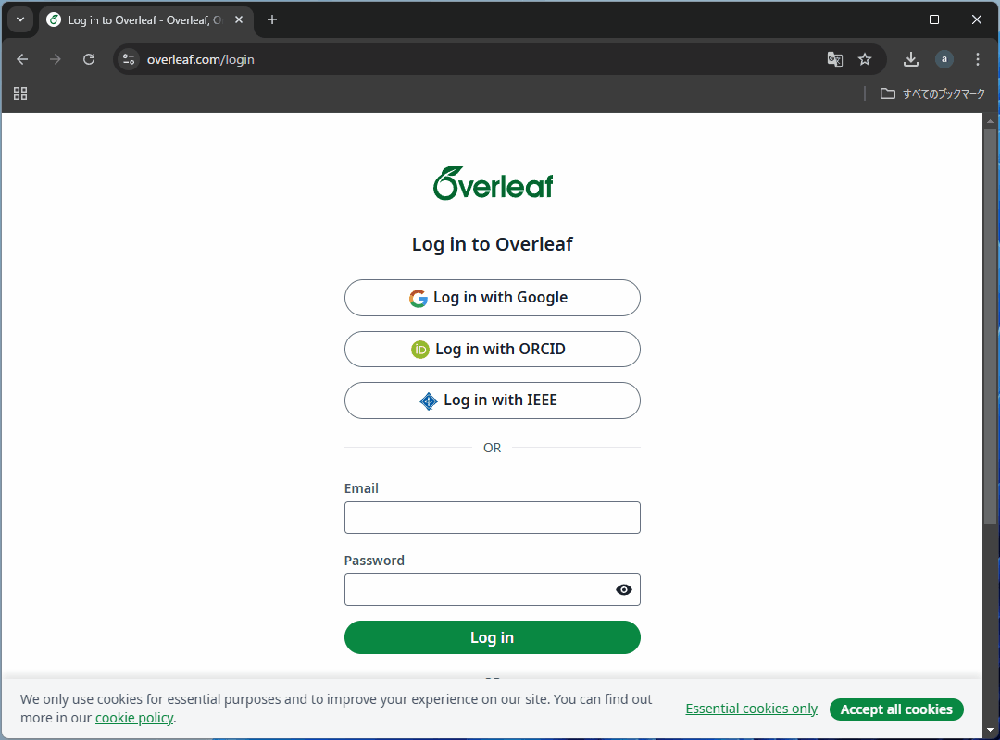
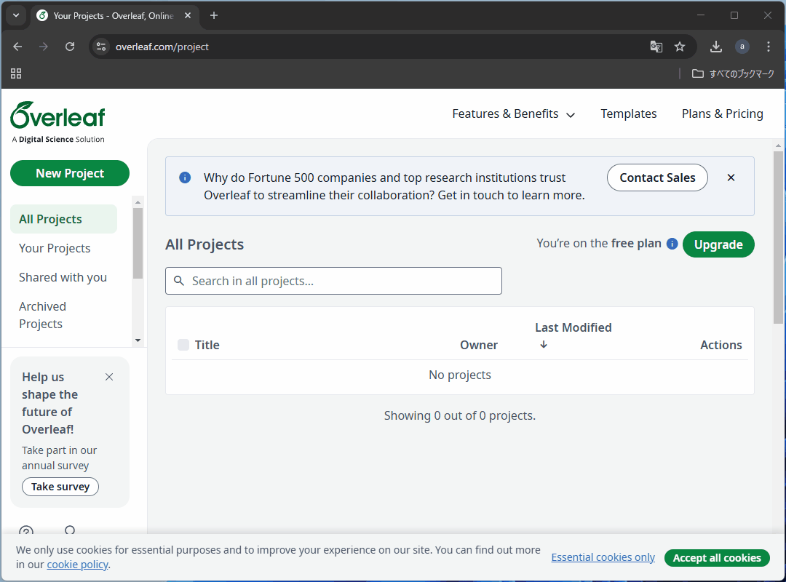
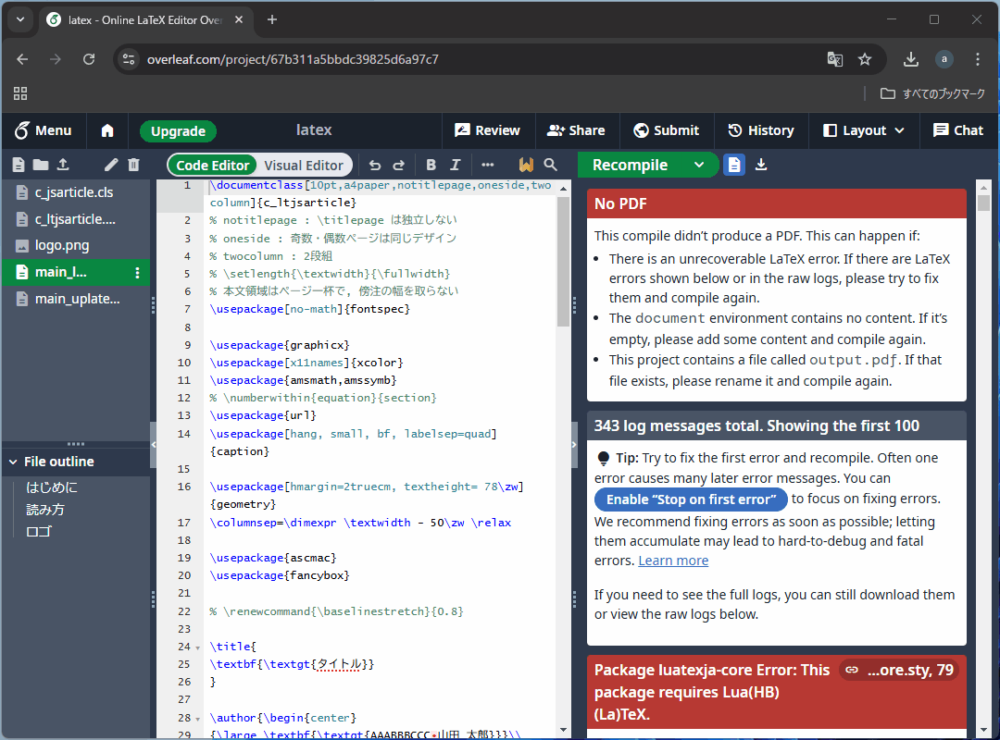

# オンライン$\LaTeX$

## $\TeX$っていいですよね～😙

数式表現以外は<u><span style={{color: "transparent"}}>クソ</span></u>ですけど～😜
えっ？$\TeX$環境がない？
じゃあ[TeX Live](https://www.tug.org/texlive/)をインストールして～

## はっぱをやらないか

$\TeX$環境を構築するのは心理的に抵抗があると思うので、まずは気軽に[はっぱ](https://ja.overleaf.com/)で$\TeX$を始めませんか？
はっぱ改め**Overleaf**はオンラインの$\LaTeX$エディタです。
サインインすれば即効ハイ($\TeX$文書をコンパイルできる状態)になれます。



## テンプレートをコンパイルする例

### プロジェクトのはじまり

まずは、テンプレートのZIPファイルをアップロードしてプロジェクトを作成しましょう。



### KSポイント①

$\LaTeX$処理系の統一感のなさゆえに、そのままではコンパイルが通らないかもしれません。
寛大な心を持ち、1億歩譲って`latexmkrc`を以下の内容で作成しましょう。

```perl
$latex = 'uplatex';
$bibtex = 'upbibtex';
$dvipdf = 'dvipdfmx %O -o %D %S';
$makeindex = 'mendex %O -o %D %S';
```

そしてコンパイラを`LaTeX`に変更します。



[関連するOverleafのドキュメント](https://ja.overleaf.com/learn/latex/Japanese#Using_pLaTeX_on_Overleaf)
